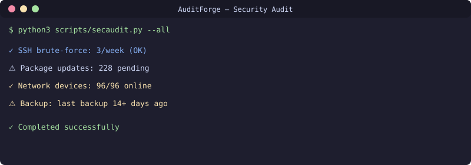

<div align="center">

[](README.md)
[](README.ru.md)
[](README.uz.md)

</div>

# Автоматизация аудита безопасности
[](https://github.com/uMax-Cyber/AuditForge/actions/workflows/ci.yml)



Еженедельный автоматизированный аудит безопасности для небольшой инфраструктуры: обнаружение SSH brute-force, отслеживание обновлений пакетов, состояние сетевых устройств, свежесть бэкапов и обнаружение изменений портов. Чистый Python, только stdlib, вывод в любой мессенджер.

## Что проверяется

| Проверка | Метод | Порог срабатывания |
|----------|-------|--------------------|
| SSH brute-force | подсчёт записей в auth-логе journalctl | > 20 неудач/неделю |
| Обновления пакетов | apt list --upgradable | > 100 ожидающих |
| Устройство офлайн | API сетевого контроллера | Любое устройство не online |
| Устаревшая прошивка | флаг API контроллера | firmwareUpdatable = true |
| Живость файрвола | проверка здоровья API | Недоступен или ошибка аутентификации |
| Свежесть бэкапов | проверка возраста файлов | Нет бэкапа за 14 дней |
| Слушающие порты | diff вывода ss -tlnp | Появились новые порты |

## Философия проекта

- **Детерминированность**: без LLM и AI — чистая логика, всегда воспроизводимо
- **Ноль зависимостей**: только stdlib Python 3.10+
- **Независимость от канала**: markdown в stdout — отправляйте в Telegram/email/Slack
- **Отсутствие состояния**: каждый запуск независим; результаты сопоставимы во времени

## Использование

```bash
# Запустить все проверки
./scripts/secaudit.py --all

# Только конкретная проверка
./scripts/secaudit.py --check ssh,updates

# Вывод в файл (для передачи в алертинг)
./scripts/secaudit.py --all > report.md
```

## Настройка cron
```bash
# Еженедельно, понедельник 09:00
0 9 * * 1 /opt/secaudit/scripts/secaudit.sh 2>/dev/null
```

## Лицензия
MIT

## 📬 Контакты

Вопросы? Пишите: **[allumaxmail@gmail.com](mailto:allumaxmail@gmail.com)**

---

<div align="center">

[](README.md)
[](README.ru.md)
[](README.uz.md)

</div>
